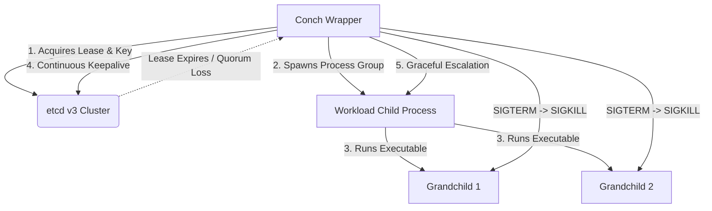

# Conch 🐚

[](https://goreportcard.com/report/github.com/andrey/conch)
[](https://opensource.org/licenses/MIT)

**Conch** is a tiny, zero-dependency, ultra-reliable distributed coordination suite built on top of `etcdv3`. Designed for minimalism, absolute predictability, and fail-closed safety, Conch provides three simple primitives to wrap and supervise standard Linux commands, processes, and cron jobs without requiring application-level etcd client code.

By acting as an intelligent wrapper, Conch manages lease renewals, leader campaigns, semaphores, and cron schedules, mapping lease failures directly to process signals to guarantee that your software never runs in an overlapping or split-brain state.

---

## 🚀 Key Features

*   **Zero-Integration Sidecar:** Wrap any standard binary or shell script (`conch elect ... -- my-app`) without modifying its source code.
*   **Fail-Closed Process Supervision:** If Conch loses connection to etcd for more than the lease TTL, it escalates termination (`SIGTERM` followed by `SIGKILL` after a grace period) to guarantee immediate execution stop.
*   **Active-Passive Leader Election (`elect`)**: Block execution or loop/restart your daemon under a global lease-backed leader office.
*   **Distributed Counting Semaphore (`sema`)**: Block or limit parallel script execution to $N$ concurrent slots across your entire fleet, with an optional `--spread` flag for high-availability node balancing.
*   **Fault-Tolerant Distributed Cron (`cron` / `conchd`)**: Schedules cron ticks deterministically in UTC. Guaranteed exactly-once execution per tick; if a node dies mid-execution, another node claims the slot, registers the failure, and triggers recovery.
*   **Deterministic Exit Codes**: Maps standard command outcomes and coordination failures to predictable, RFC-like exit codes for robust scripting.

---

## 🛠️ Architecture: The Wrapper Principle

Conch is built on the principle of **strict external process control**. Instead of library-level coordination, it runs your workload as a supervised child process group:



If etcd quorum fails or the lease cannot be renewed, Conch starts a deterministic teardown:
1. **`SIGTERM`** is sent to the child process *group* (targeting grandchildren too).
2. A configurable **grace timer** starts (e.g., `--kill-after 5s`).
3. If the process hasn't exited by the deadline, **`SIGKILL`** is broadcast to the group.
4. Conch exits with **Code 70** (hold loss).

---

## ⚙️ Installation & Sharing

### 1. Manual Compilation
Conch is written in pure Go and compiles into a single static binary with no external run-time dependencies:
```bash
# Clone the repository
git clone ssh://10.0.1.3:2222/andrey/configs.git
cd tools/conch

# Compile statically
CGO_ENABLED=0 go build -ldflags="-s -w" -o conch cmd/conch/main.go
```

### 2. Nix & NixOS Flakes (Recommended)
You can expose Conch as a Nix flake to distribute it cleanly across NixOS clusters or development shells:
```nix
# flake.nix
{
  description = "Conch - tiny etcd coordination suite";
  inputs.nixpkgs.url = "github:NixOS/nixpkgs/nixos-unstable";
  outputs = { self, nixpkgs }: {
    packages.x86_64-linux.default = nixpkgs.legacyPackages.x86_64-linux.buildGoModule {
      pname = "conch";
      version = "1.0.0";
      src = ./tools/conch;
      vendorHash = null; # uses go.mod vendoring
    };
  };
}
```

### 3. Sharing via Docker
To containerize workloads using Conch, copy the static binary directly into your base images:
```dockerfile
FROM golang:1.22-alpine AS builder
WORKDIR /app
COPY . .
RUN CGO_ENABLED=0 go build -o conch cmd/conch/main.go

FROM alpine:latest
COPY --from=builder /app/conch /usr/local/bin/conch
# Wrap your application execution
ENTRYPOINT ["conch", "elect", "api-leader", "--"]
CMD ["/app/my-daemon"]
```

---

## 📖 Command Guide

Every Conch command accepts standard global flags:
*   `--endpoints`: Comma-separated list of etcd nodes (default: `127.0.0.1:2379`).
*   `--dial-timeout`: Dial timeout duration (default: `3s`).
*   `--ttl`: Lease TTL duration (default: `6s`).
*   `--quiet`: Suppress wrapper-level logging (only output child logs).

---

### 1. Leader Election (`elect`)
Ensure that only one instance of a daemon runs globally.

#### Campaign and Run
```bash
conch elect api-leader --ttl=6s --kill-after=5s -- /usr/local/bin/api-server --port 8080
```
*   If another node holds `api-leader`, Conch blocks until the slot is vacant.
*   Once won, it spawns `api-server`.
*   If etcd loses quorum, it shuts down `api-server` using the `SIGTERM` $\rightarrow$ 5s $\rightarrow$ `SIGKILL` escalation.

#### Continuous Re-Campaign Loop (`--restart`)
Ideal for long-running systemd services that should instantly re-campaign on network splits:
```bash
conch elect worker-pool --restart -- /usr/local/bin/worker
```

#### Query and Observe Leader
```bash
# Get current leader details
conch elect api-leader --who

# Stream leadership handovers and vacancy in real-time
conch elect api-leader --watch
```

#### Leadership Assertion (`--assert`)
A fast, read-only predicate to check if the current host holds leadership of an office, with a fail-closed design:
```bash
# Check if this host holds leadership (exit code 0 if yes, 1 if no, 69 if etcd unreachable)
conch elect api-leader --assert

# Check with a minimum create-revision term
conch elect api-leader --assert --min-rev 12345 --json
```

#### Synchronous Transition Hooks (`--on-acquire` / `--on-lose`)
Execute custom setup and teardown tasks synchronously on leadership transitions, running inside the office holder's process group with a configurable timeout (default 30s):
```bash
conch elect database-primary \
  --on-acquire "pg_ctl promote" \
  --on-lose "pg_ctl demote" \
  --hook-timeout 45s \
  --restart -- postgres
```

---

### 2. Counting Semaphore (`sema`)
Control concurrency limit globally. Useful for rolling deployments, database migration gates, or expensive background batching.

#### Restrict Concurrency to $N$ slots
```bash
conch sema heavy-jobs --max=3 -- /usr/local/bin/process-video.sh
```
*   Allows at most 3 nodes to run `process-video.sh` at the exact same time.
*   Additional invocations will queue orderly, sorting by their acquisition revision.

#### High-Availability Node Balancing (`--spread`)
Enforces that at most 1 slot can be held *per physical hostname*, preventing resource starvation on single nodes:
```bash
conch sema ingest-worker --max=5 --spread -- /usr/local/bin/ingest
```

#### Non-Blocking Acquisition
Exit immediately if no slots are currently available:
```bash
conch sema DB_MIGRATION --max=1 --nonblock -- ./run-migration.sh
# Exits with Code 75 immediately if slot is occupied
```

---

### 3. Distributed Cron Daemon (`conchd`)
Runs a distributed scheduler across multiple nodes. Guarantees exactly-once execution per scheduled tick.

#### Launch Daemon on Nodes
Run the daemon on all cluster machines. They will automatically form a highly available consensus group:
```bash
conch conchd --endpoints=10.1.1.1:2379,10.1.1.2:2379,10.1.1.3:2379
```

#### Register and Manage Cron Jobs
```bash
# Add or update a job
conch cron add backup-db "0 2 * * *" --ttl=30s --kill-after=5s -- /app/backup.sh

# Remove a job (any currently in-flight tick is permitted to finish)
conch cron rm backup-db

# List all registered cron jobs
conch cron list
```

#### Retrieve Task Results
All job runs, timestamps, start times, durations, and exit codes are recorded inside etcd:
```bash
conch cron results backup-db
```

---

## 🚦 Exit Codes Specification

Conch conforms to a strict exit code protocol to allow shell scripting integration:

| Exit Code | Classification | Meaning |
| :---: | :--- | :--- |
| **`0`** | Success | Child process exited with exit code `0`. |
| **`1..63`** | Workload Exit | Child process failed; Conch returns the child's exact exit code. |
| **`64`** | Usage Error | CLI flag syntax error or missing mandatory parameters. |
| **`69`** | infrastructure Error | etcd was unreachable or connection timed out during startup. |
| **`70`** | Hold Loss | Conch lost lease renewal / connection during run; child was terminated. |
| **`75`** | Non-block / Timeout | `--nonblock` or `--wait` threshold expired before acquiring the slot. |

---

## 🧪 Testing

Conch relies on a rigorous test suite covering real-world network splits, lease timeouts, and concurrency invariants against a running etcd instance.

```bash
# Run tests with the race detector
go test -v -race ./...

# Run the automated 3-node cluster chaos suite
./test-cluster-chaos.sh
```

---

## 📚 Specification Index
For deeper architectural specifications, refer to the local proposal papers:
*   [00_design.md](00_design.md) - High-level motivation, primitives, and end-state.
*   [02_core.md](02_core.md) - authoritative Process supervision, signal handling, and lease specifications.
*   [03_elect.md](03_elect.md) - Leader election specification.
*   [04_sema.md](04_sema.md) - Counting and spread semaphore specifications.
*   [05_cron.md](05_cron.md) - Distributed scheduler and tick state machines.
